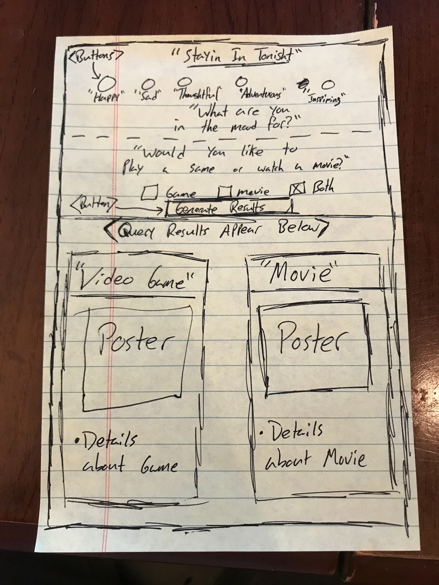
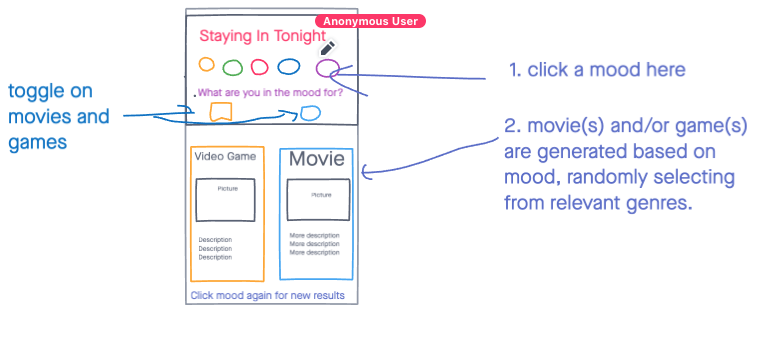
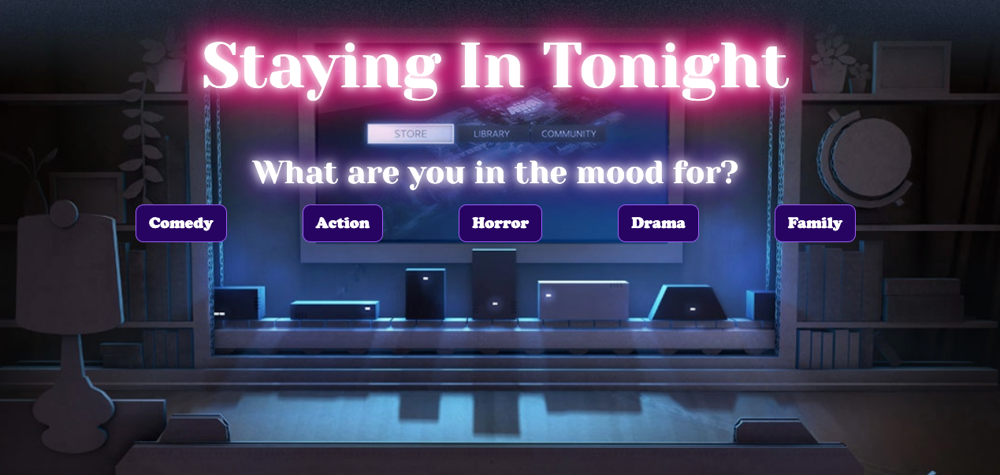
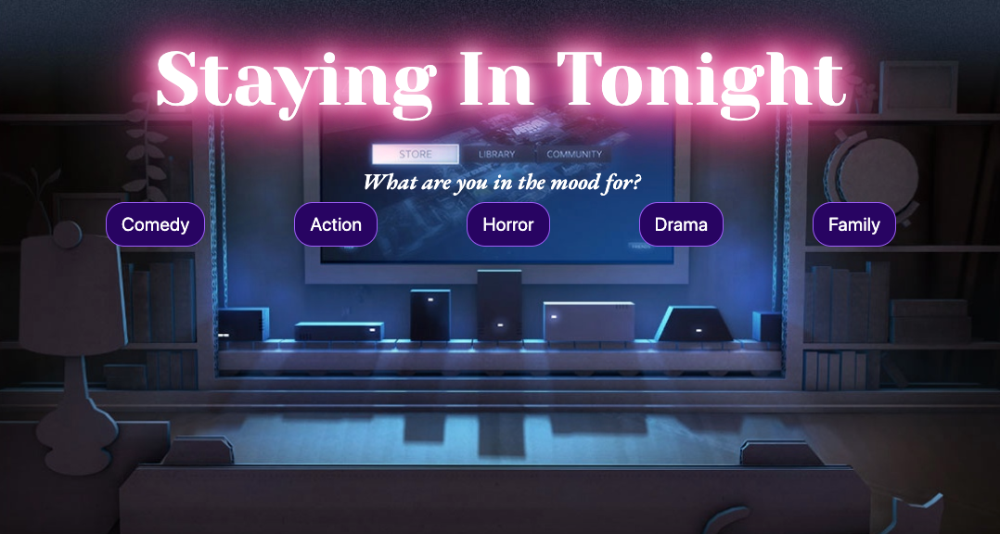
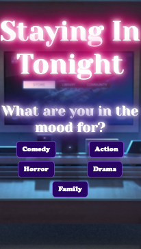
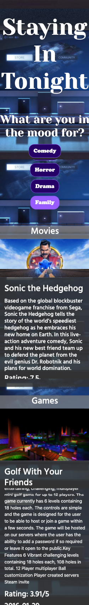

# Staying in Tonight

## Table of Contents

- [Description](#description)
- [Installation](#installation)
- [Usage](#usage)
- [Links](#links)
- [Credits](#credits)
- [License](#mit_license)

## Description

“Staying in Tonight” serves as a tool to help users make a decision about how to spend a night staying at home, by either watching a movie or playing a video game.
When the user opens the page, they are met by a series of selectors indicating various genres. These buttons reflect the genre of the content that will be generated upon clicking the corresponding button.

For example, if the user chooses the genre Comedy, the suggestions generated will be under the genre of Comedy, for both video games and movies. A poster of a random game and movie will appear below the buttons, featuring a brief overview of the media, release date, and a critic’s rating.

## Installation

This code can be forked and cloned onto one's local device through GitHub. Please make sure you are using the correct application for administering this code onto your device, such as Terminal and Visual Studio Code.

## Usage

The primary usage of this application is to entertain user by offering him or her opportunity to whatch a movie or to play a video game based on their mood.

The following screenshots demonstrates the application functionality on desktop and on mobile:

## Links

[GitHub repository](https://github.com/cheacliatt/gt-Project-One "Repository")

[Link to Deployed Staying-In-Tonight Application](https://cheacliatt.github.io/gt-Project-One/ "Pages")

## Credits

This was a was a group project comlepeted by Stuart Scott, Chea Cliatt, Scott Griffin and Volodymyr Petrytsya.

## License

MIT License

Copyright (c) [2020][chea cliatt, scott griffin, stuart scott, volodymyr petrytsya]

Permission is hereby granted, free of charge, to any person obtaining a copy
of this software and associated documentation files (the "Software"), to deal
in the Software without restriction, including without limitation the rights
to use, copy, modify, merge, publish, distribute, sublicense, and/or sell
copies of the Software, and to permit persons to whom the Software is
furnished to do so, subject to the following conditions:

The above copyright notice and this permission notice shall be included in all
copies or substantial portions of the Software.

THE SOFTWARE IS PROVIDED "AS IS", WITHOUT WARRANTY OF ANY KIND, EXPRESS OR
IMPLIED, INCLUDING BUT NOT LIMITED TO THE WARRANTIES OF MERCHANTABILITY,
FITNESS FOR A PARTICULAR PURPOSE AND NONINFRINGEMENT. IN NO EVENT SHALL THE
AUTHORS OR COPYRIGHT HOLDERS BE LIABLE FOR ANY CLAIM, DAMAGES OR OTHER
LIABILITY, WHETHER IN AN ACTION OF CONTRACT, TORT OR OTHERWISE, ARISING FROM,
OUT OF OR IN CONNECTION WITH THE SOFTWARE OR THE USE OR OTHER DEALINGS IN THE
SOFTWARE.
